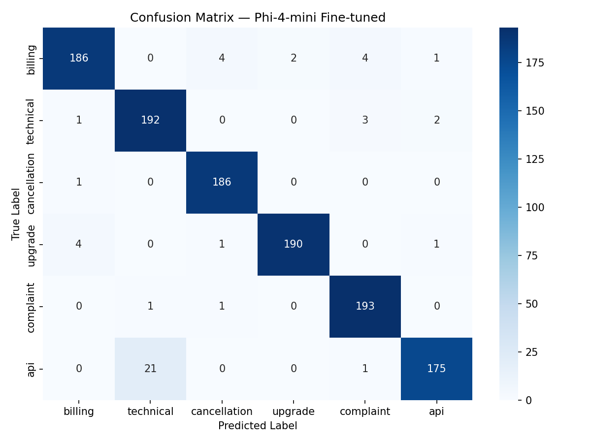
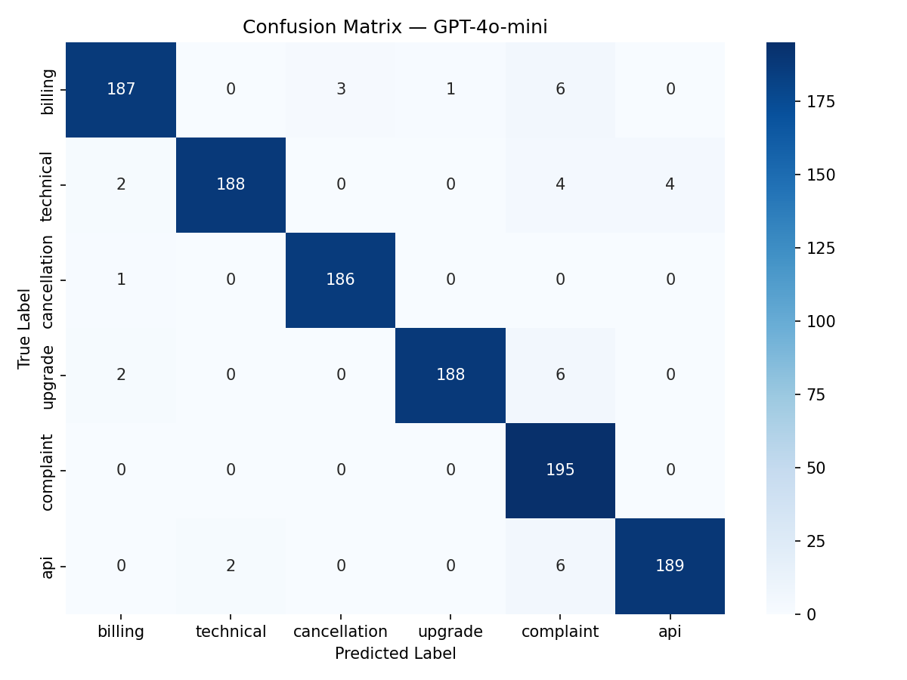

# Support Ticket Router

<p align="center"> <br> <strong>Fine-tuned SLM for Automatic Customer Support Intent Classification & Routing</strong> </p> <p align="center">       </p>

---

## Abstract

**Support Ticket Router** is an AI-powered system that automatically classifies incoming customer support messages into one of six intents and routes each ticket to the appropriate team — eliminating manual triage entirely.

The core model is **Phi-4-mini-instruct** fine-tuned with **Unsloth + LoRA** on a synthetically generated dataset of ~11,700 labeled samples. The system achieves **95.91% macro F1** — matching GPT-4o-mini zero-shot (96.87%) within 1 percentage point — while delivering **~3× lower inference latency** (~224ms vs ~700ms) and running entirely locally with zero API cost.

The model is exported to **GGUF q4_k_m** format via llama.cpp, enabling deployment on both GPU (RTX 3060 6GB) and CPU-only environments without any cloud dependency. Inference is handled by a **dual-model pipeline** combining the quantized SLM with an optional GPT-4o-mini fallback, running in parallel with a voting-based consensus mechanism. The REST API exposes both single and batch classification endpoints with per-intent routing and auto-action metadata.

---

## Table of Contents

1. 📜 [Abstract](#abstract)
2. 🏗️ [Architecture](#architecture)
3. ✨ [Features](#features)
4. 📊 [Intent Taxonomy](#intent-taxonomy)
5. 🛠️ [Tech Stack](#tech-stack)
6. 🔬 [Dataset & Training](#dataset--training)
7. 📈 [Evaluation Results](#evaluation-results)
8. ⚙️ [System Requirements](#system-requirements)
9. 🚀 [Quick Start](#quick-start)
10. 🔌 [API Reference](#api-reference)
11. 📄 [License](#license)

---

## Architecture

### End-to-End Pipeline

The system is composed of three sequential stages: **data generation → fine-tuning → inference API**.

**Stage 1 — Synthetic Data Generation (`scripts/generate_data.py`)**

Customer support messages are generated via the GPT-4o-mini API, using a taxonomy-driven prompt strategy. Each intent has a structured definition, seed examples, and explicit edge cases to prevent label leakage. Batches of 25 samples are generated per intent with temperature 0.9, yielding ~2,000 samples per class before deduplication.

**Stage 2 — Fine-tuning (`scripts/train.py`)**

Phi-4-mini-instruct is fine-tuned using Unsloth's `FastLanguageModel` with LoRA adapters (`r=16`, `alpha=16`) applied to all attention and MLP projection layers. Training uses `SFTTrainer` from TRL over 3 epochs with early stopping, with the dataset formatted as instruction-completion prompts. The final model is merged to fp16 and exported to GGUF (q4_k_m) for deployment.

**Stage 3 — Inference API (`api/`)**

A FastAPI service wraps a dual-model inference engine. On each request, the fine-tuned GGUF model and GPT-4o-mini run in parallel via `asyncio.gather`. Results are aggregated through a majority-vote consensus. The winning intent is mapped to a routing team and automated action via static configuration tables.

```
User Message
    │
    ▼
┌─────────────────────────────┐
│      FastAPI /classify       │
└─────────────┬───────────────┘
              │  asyncio.gather (parallel)
    ┌─────────┴──────────┐
    ▼                    ▼
Phi-4-mini-GGUF     GPT-4o-mini
(local, q4_k_m)     (OpenAI API)
    └─────────┬──────────┘
              ▼
     Majority Vote Consensus
              │
    ┌─────────┴──────────┐
    ▼                    ▼
 Intent Label      Routing + Action
    (e.g. billing)  (Finance & Billing Team)
```

---

## Features

- 🎯 **95.91% macro F1** — matches GPT-4o-mini zero-shot (96.87%) within 1 pp at zero API cost
- ⚡ **~3× faster inference** — ~224ms avg latency vs ~700ms for GPT-4o-mini on the same hardware
- 🖥️ **CPU-compatible** — GGUF q4_k_m quantization runs on CPU-only machines (~150–200ms), no GPU required
- 📦 **Batch classification** — `/classify-batch` endpoint for high-throughput use cases
- 🗂️ **Auto-routing** — each intent mapped to a team and an automated action
- 🧪 **Synthetic dataset** — ~11,700 clean samples generated via GPT-4o-mini + taxonomy-driven prompting
- 📊 **Reproducible training** — Unsloth + LoRA pipeline with early stopping and TensorBoard logging
- 🔍 **Structured evaluation** — classification report, confusion matrix, confidence analysis

---

## Intent Taxonomy

The system classifies messages into 6 customer support intents with explicit decision boundaries to prevent label overlap:

|Intent|Definition|Auto-Routed To|Automated Action|
|---|---|---|---|
|`billing`|Payment, invoice, charge, refund, or pricing issues|Finance & Billing Team|Auto-generate invoice correction ticket|
|`technical`|Bug reports, crashes, errors, or broken features|L1 Technical Support|Open bug report & assign engineer|
|`cancellation`|Explicit or implicit intent to stop, cancel, or not renew the service|Customer Retention Team|Trigger retention offer workflow|
|`upgrade`|Requests to change plan tier (upgrade or downgrade)|Sales / Account Manager|Send pricing comparison + book demo|
|`complaint`|General dissatisfaction with no specific technical or billing root cause|Customer Experience Team|Priority queue + manager escalation|
|`api`|Developer questions about endpoints, tokens, SDKs, webhooks, rate limits|Developer Support|Link to docs + assign DevRel|

**Key edge cases enforced:**

- Upgrade pricing questions → `upgrade`, not `billing`
- API errors with a concrete system failure → `technical` over `api`
- `complaint` is a weak fallback label — never assigned when a concrete action exists

---

## Tech Stack

| Component       | Technology                        | Purpose                                    |
| --------------- | --------------------------------- | ------------------------------------------ |
| Base Model      | unsloth/Phi-4-mini-instruct       | Foundation LLM for classification          |
| Fine-tuning     | Unsloth + LoRA (r=16)             | Parameter-efficient supervised fine-tuning |
| Training        | TRL SFTTrainer                    | Instruction-following SFT pipeline         |
| Quantization    | GGUF q4_k_m via llama.cpp         | Local inference on consumer GPU/CPU        |
| Data Generation | OpenAI GPT-4o-mini                | Synthetic dataset generation               |
| API             | FastAPI + Pydantic                | REST inference service                     |
| Baseline        | GPT-4o-mini (zero-shot)           | Comparison baseline                        |
| Evaluation      | scikit-learn, matplotlib, seaborn | Metrics, confusion matrix, analysis        |

---

## Dataset & Training

### Data Generation

Synthetic data was generated using `GPT-4o-mini` via a structured batch-prompt pipeline. Each intent in `data/intent_taxonomy.json` defines a formal definition, seed examples, and edge cases used to constrain generation and prevent cross-label contamination.

- **Generation**: 2,000 samples/class × 6 classes = 12,000 raw samples
- **After deduplication**: 11,693 samples (291 duplicates removed, concentrated in `cancellation` and `complaint`)
- **Final split**: 80% train / 10% val / 10% test, stratified by label

**Class distribution after deduplication:**

|Intent|Count|
|---|---|
|technical|1,974|
|billing|1,972|
|api|1,968|
|upgrade|1,958|
|complaint|1,949|
|cancellation|1,872|

### Prompt Format

All training and inference samples use a consistent instruction-completion format:

```
Classify the customer support message into one of these intents:
api, billing, cancellation, complaint, technical, upgrade

Rules:
- If message mentions API-related terms (api, endpoint, token, request, response, webhook, integration) → api
- Even if there is error, failure, or not working → STILL api
- bug, crash, not working (no API) → technical
- payment, charge → billing
- cancel/stop → cancellation
- change plan → upgrade
- otherwise → complaint
Message: {text}

Intent: {label}
```

### Training Configuration

|Parameter|Value|
|---|---|
|Base model|Phi-4-mini-instruct|
|LoRA rank (r)|16|
|LoRA alpha|16|
|LoRA dropout|0|
|Target modules|q, k, v, o, gate, up, down proj|
|Max sequence length|256|
|Batch size (per device)|2|
|Gradient accumulation steps|4|
|Effective batch size|8|
|Learning rate|2e-4|
|Epochs|3 (early stopping)|
|Optimizer|paged_adamw_32bit|
|Mixed precision|bf16 / fp16|
|Export format|merged fp16 + GGUF q4_k_m|

---

## Evaluation Results

### Model Comparison

|Metric|Phi-4-mini (fine-tuned)|GPT-4o-mini (zero-shot)|
|---|---|---|
|**F1 Macro**|**95.36%**|96.87%|
|**Accuracy**|**95.9%**|96.84%|
|Avg Latency|~224 ms|~700 ms|
|Deployment|Local (RTX 3060 6GB)|OpenAI API|
|Cost per call|~$0|~$0.000015|

> The fine-tuned SLM matches GPT-4o-mini F1 within 1 pp (95.91% vs 96.87%), runs **~3× faster** (~224ms vs ~700ms), and incurs **zero API cost** — deployable on both GPU and CPU-only environments.

### Per-Class Results — Fine-tuned SLM



|Intent|Precision|Recall|F1|Support|
|---|---|---|---|---|
|billing|0.9688|0.9442|0.9563|197|
|technical|0.8972|0.9697|0.9320|198|
|cancellation|0.9688|0.9947|0.9815|187|
|upgrade|0.9698|0.9694|0.9794|196|
|complaint|0.9602|0.9897|0.9747|195|
|api|0.9777|0.8883|0.9309|197|
|**Macro**|**0.9604**|**0.9593**|**0.9591**|1170|


### Per-Class Results — GPT-4o-mini Baseline



|Intent|Precision|Recall|F1|Support|
|---|---|---|---|---|
|billing|0.9740|0.9492|0.9614|197|
|technical|0.9895|0.9495|0.9691|198|
|cancellation|0.9947|0.9947|0.9894|187|
|complaint|0.8986|1.0000|0.9466|195|
|upgrade|0.9947|0.9592|0.9766|196|
|api|0.9793|0.7600|0.9692|197|
|**Macro**|**0.9700**|**0.9687**|**0.9687**|1170|

**Key observations:**

- The fine-tuned SLM runs at **~224ms avg latency** — approximately **3× faster** than GPT-4o-mini (~700ms) — while matching its F1 within 1 pp (95.91% vs 96.87%)
- GGUF q4_k_m quantization enables **CPU-only deployment** (~150–200ms on modern CPU) with no GPU or cloud dependency required
- Zero recurring API cost: once deployed locally, inference is free regardless of request volume
- GPT-4o-mini struggles on `api` recall (0.76) — confuses API-specific questions with `technical`; the fine-tuned SLM recovers this to 0.888 via explicit rule injection in the prompt
- `cancellation` and `complaint` are the strongest classes for the SLM, both above 0.97 F1
- `technical` precision (0.897) is the main weakness — minor bleed from `api` intent at boundary cases

---

## System Requirements

|Component|Minimum|Recommended|
|---|---|---|
|GPU|NVIDIA 6GB VRAM|NVIDIA 8GB+ VRAM|
|RAM|16GB|32GB|
|CUDA|12.x+|12.x+|
|Storage|20GB|50GB|
|Python|3.10+|3.12|

> **CPU-only inference:** Supported via GGUF (`n_gpu_layers=0`). Expect ~150–200ms latency depending on hardware.

---

## Quick Start

### 1. Clone the repository

```bash
git clone https://github.com/cngchis/support-ticket-router.git
cd support-ticket-router
```

### 2. Install dependencies

```bash
conda create -n ticket-router python=3.12
conda activate ticket-router
pip install -r requirements.txt
```

### 3. Configure environment variables

```bash
# .env
OPENAI_API_KEY=your_openai_api_key # if u have it
MODEL_PATH=cngchis/phi4-mini-intent
GGUF_PATH=models/phi-4-mini-intent-q4_k_m.gguf
```

### 4. Start the inference API

```bash
uvicorn api.main:app --port 8000
```

---

## 🐳 Quickstart with Docker

### Prerequisites
- Docker & Docker Compose installed
- NVIDIA GPU + [NVIDIA Container Toolkit](https://docs.nvidia.com/datacenter/cloud-native/container-toolkit/install-guide.html) (optional — for GPU acceleration)

### 1. Clone the repository
```bash
git clone https://github.com/cngchis/support-ticket-router.git
cd support-ticket-router
```

### 2. Setup environment variables
```bash
cp .env.example .env
```

Edit `.env`:
```bash
# Model — choose local or HuggingFace Hub
MODEL_PATH=cngchis/phi4-mini-intent
GGUF_REPO=cngchis/phi4-mini-intent-GGUF
GGUF_FILE=phi-4-mini-intent-q4_k_m.gguf

# Optional
OPENAI_API_KEY=sk-... # GPT-4o-mini baseline
HF_TOKEN=hf_... # if model repo is private
```

### 3. Build and run
```bash
docker compose up --build
```

### 4. Test the API
```bash
curl -X POST http://localhost:8000/classify \
  -H "Content-Type: application/json" \
  -d '{"text": "My invoice shows wrong amount", "include_model_details": true}'
```

Expected response:
```json
{
  "intent": "billing",
  "routed_to": "Finance & Billing Team",
  "auto_action": "Auto-generate invoice correction ticket",
  "latency_ms": 523.4,
  "confidence": 0.95
}
```

### 5. Open Swagger UI
```
http://localhost:8000/docs
```

---

## API Reference

### `POST /classify`

Classify a single customer support message.

**Request**

```json
{
    "text": "I was charged twice this month and I want a refund.",
    "include_model_details": false
}
```

**Response**

```json
{
    "intent": "billing",
    "routed_to": "Finance & Billing Team",
    "auto_action": "Auto-generate invoice correction ticket",
    "latency_ms": 230.5,
    "confidence": 0.94,
    "individual_latencies": {
        "phi4_gguf": 230.5,
        "gpt4o_mini": 812.3
    }
}
```

**With model details** (`include_model_details: true`)

```json
{
    "intent": "billing",
    "routed_to": "Finance & Billing Team",
    "auto_action": "Auto-generate invoice correction ticket",
    "latency_ms": 214.5,
    "confidence": 0.94,
    "individual_latencies": { ... },
    "model_results": [
        { "intent": "billing", "latency_ms": 214.5, "confidence": 0.93, "model": "phi4_gguf" },
        { "intent": "billing", "latency_ms": 812.3,  "confidence": 0.92, "model": "gpt4o_mini" }
    ]
}
```

---

### `POST /classify-batch`

Classify multiple messages in a single request.

**Request**

```json
[
    { "text": "How do I cancel my subscription?" },
    { "text": "My API key is returning 401 Unauthorized." },
    { "text": "I want to upgrade to the Pro plan." }
]
```

**Response**

```json
{
    "results": [
        {
            "text": "How do I cancel my subscription?",
            "intent": "cancellation",
            "routed_to": "Customer Retention Team",
            "auto_action": "Trigger retention offer workflow",
            "latency_ms": 205.2,
            "confidence": 0.94
        },
        {
            "text": "My API key is returning 401 Unauthorized.",
            "intent": "api",
            "routed_to": "Developer Support",
            "auto_action": "Link to docs + assign DevRel",
            "latency_ms": 280.7,
            "confidence": 0.95
        },
        {
            "text": "I want to upgrade to the Pro plan.",
            "intent": "upgrade",
            "routed_to": "Sales / Account Manager",
            "auto_action": "Send pricing comparison + book demo",
            "latency_ms": 218.4,
            "confidence": 0.96
        }
    ]
}
```

---

### `GET /`

Health check endpoint.

```json
{
    "status": "ok",
    "model": "phi4-intent-finetuned-dual-model",
    "version": "2.0.0"
}
```

**Routing & Action Map:**

| Intent       | Routed To                | Automated Action                        |
| ------------ | ------------------------ | --------------------------------------- |
| billing      | Finance & Billing Team   | Auto-generate invoice correction ticket |
| technical    | L1 Technical Support     | Open bug report & assign engineer       |
| cancellation | Customer Retention Team  | Trigger retention offer workflow        |
| upgrade      | Sales / Account Manager  | Send pricing comparison + book demo     |
| complaint    | Customer Experience Team | Priority queue + manager escalation     |
| api          | Developer Support        | Link to docs + assign DevRel            |

---

## License

Apache License 2.0 — see LICENSE for details.